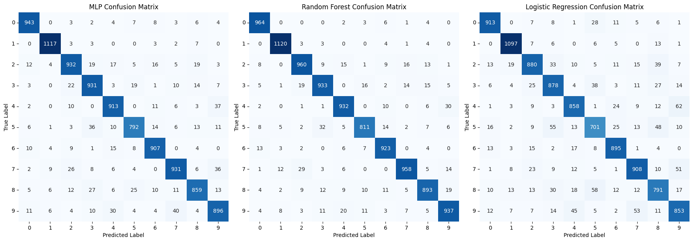

# MNIST Digit Classification using Multi-Layer Perceptron (MLP)

## Overview
This project focuses on training a Multi-Layer Perceptron (MLP) on the MNIST dataset, evaluating its performance against Random Forest (RF) and Logistic Regression models. The analysis includes F1-score and confusion matrix metrics, alongside visualizations using t-SNE to understand the embeddings from the MLP's hidden layers.

## Datasets
- **MNIST Dataset**: 
  - Contains 60,000 training images and 10,000 test images of handwritten digits (0-9).
- **Fashion-MNIST Dataset**: 
  - Used for testing the generalization of the trained MLP model on a different dataset containing fashion items.

## Methodology

### 1. Data Preparation
- Use the original MNIST dataset 

### 2. Model Architecture
- **MLP Architecture**:
  - Input Layer: 784 neurons (28x28 pixel images)
  - Hidden Layer 1: 30 neurons
  - Hidden Layer 2: 20 neurons
  - Output Layer: 10 neurons (corresponding to the 10 digit classes)

### 3. Model Training
- Train the MLP on the MNIST dataset.
- Implement and compare with Random Forest (RF) and Logistic Regression models.

### 4. Performance Analysis

### 5. Observations
- Analyze common misclassifications between the digits based on the confusion matrix.

### 6. t-SNE Visualization
- Plot t-SNE for embeddings from the second layer of the MLP:
  - For the trained MLP
  - For an untrained MLP
- Contrast these visualizations to draw conclusions about how training affects the feature representation.

### 7. Fashion-MNIST Predictions
- Use the trained MLP model to predict on the Fashion-MNIST dataset.
- Observe the performance and compare the t-SNE visualizations of the second layer embeddings for both MNIST and Fashion-MNIST images.

